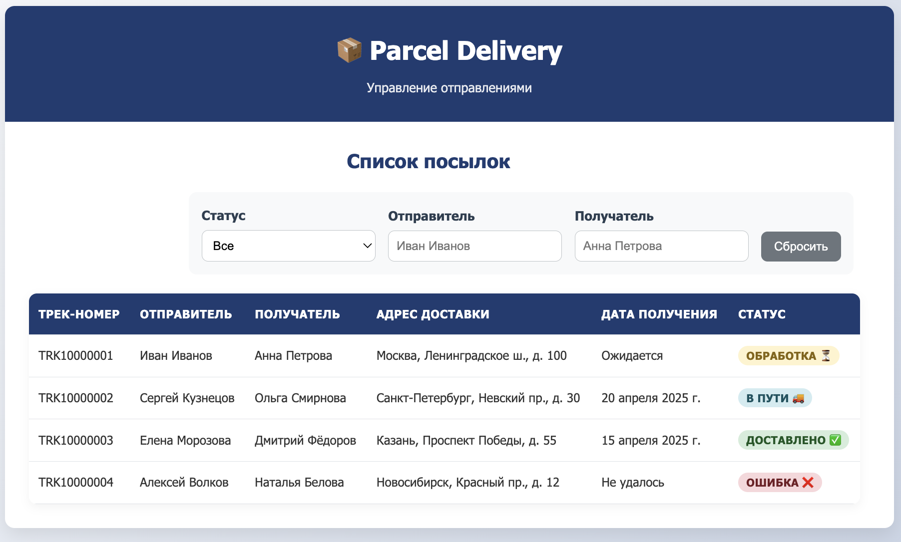
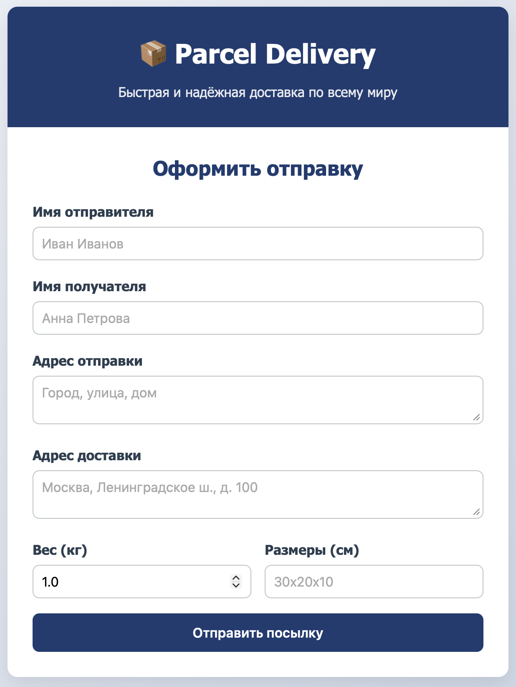
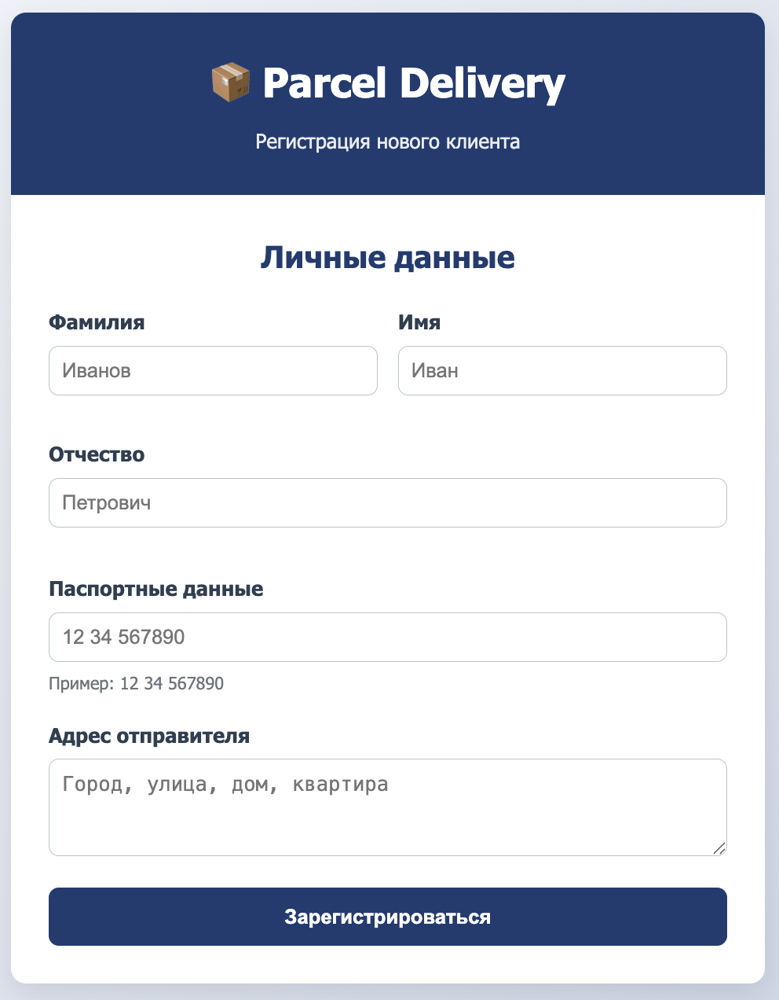
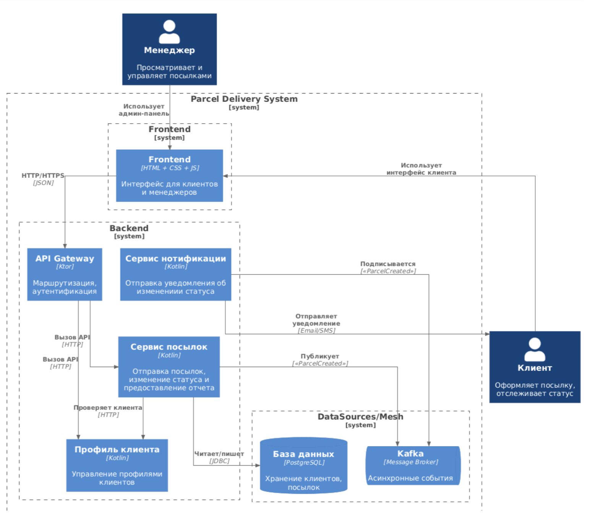

# Parcel Delivery

Cервис для доставки посылок. Компания принимает заказы на доставку посылок от пользователей через API. Сервис управляет доставками посылок и отправляет уведомление клиентам при изменении статуса.  

## Целевая аудитория

Сервис ориентирован на пользователей, ценящих простоту оформления, отслеживание в реальном времени и удобные способы взаимодействия.

### Портреты клиентов

**Менеджер**
    1. Обрабатывает запросы клиентов и изменение статусов посылок
    2. Работает с системой ежедневно

**Клиент**

    1. Активно использует интернет-магазины, периодически отправляет посылки родственникам
    2. Часто получает посылки от детей и внуков
    3. Оформляет доставку оффлайн, самостоятельно через сайт или мобильное приложение

Подробнее [описание целевой аудитории](docs/01-biz/01-target-audience.md).

## MVP

Минимальный продукт включает:
- CRUD-операции сущности Клиент
- CRUD-операции сущности Посылка
- Изменение статусов доставки: ("Принято", "В пути", "Ожидает вручения", "Доставлено")
- Уведомление клиентов об изменеии статуса доставки через Kafka-consumer

### Эскиз фронтенд-представления

Основные экраны:
1. **Форма регистрации клиента** — данные клиента 
2. **Список посылок** — таблица с фильтрацией по статусу
3. **Карточка оформления доставки** — данные заказа

## Сущности

### Client

| Поле      | Тип      | Описание                 |
|-----------|----------|--------------------------|
| id        | UUID     | Уникальный идентификатор |
| personal  | String   | ФИО клиента              |
| address   | String   | Адрес                    |
| email     | String   | Электронная почта        |
| phone     | String   | Номер телефона           |

### Order

| Поле              | Тип            | Описание                      |
|-------------------|----------------|-------------------------------|
| id                | UUID           | Уникальный идентификатор      |
| senderClientId    | UUID           | Ссылка на клиента-отправителя |
| recipientClientId | UUID           | Ссылка на клиента-получателя  |
| status            | DeliveryStatus | Текущий статус                |
| sendDate          | DateTime       | Дата отправления              |
| receiveDate       | DateTime       | Дата получения                |
| weight            | Number         | Вес, кг                       |
| size              | String         | Габариты, ШхВхГ               |

### DeliveryStatus

- **APPLYED** — заказ создан
- **DELIVERING** — заказ подтверждён
- **WAITING** — заказ выполняется
- **DELIVERED** — заказ завершён

## Архитектура

Компоненты:

- **Клиент / Менеджер** — пользователи системы, взаимодействующие через веб-интерфейс (HTML + CSS + JS)
- **API Gateway (Ktor)** — точка входа: маршрутизация и  аутентификация
- **Backend (Kotlin, Ktor)** — REST API: управление клиентами, посылками, статусами
- **Сервис нотификаций (Kotlin, Ktor)** — Kafka-consumer, отправляет уведомление при смене статуса
- **PostgreSQL** — основная БД: хранение клиентов и посылок
- **Kafka** — брокер сообщений для асинхронных событий

Связи:
- **Клиент / Менеджер → Frontend**: HTTP/HTTPS для работы с UI
- **Frontend → API Gateway**: HTTP-запросы (REST)
- **API Gateway → Backend**: проксирование и валидация трафика
- **Backend → PostgreSQL**: JDBC для CRUD-операций
- **Backend → Kafka**: публикация событий при создании посылки/изменении статуса
- **Kafka → Сервис нотификаций**: подписка на события смены статуса
- **Сервис нотификаций → Клиент**: отправка email/SMS